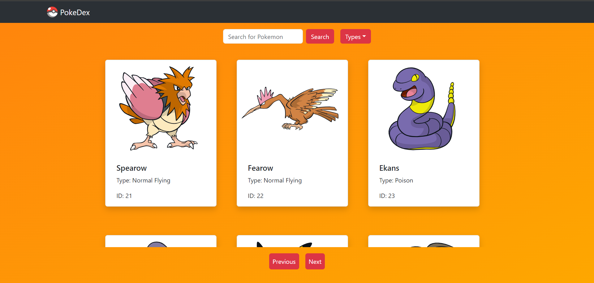

# POKEDEX 
A React application that allows users to retrieve, search, and dissect different Pokemon by their statistics using Pokemon API
<p align="center">
<span>

</span>
</p>


## Technology Stack

<p align="center">
<span>


</span>
</p>

## Wireframe
<p align="center">
<span>

</span>
</p>

## Installation

Initialise git on your terminal:
```
git init
```
<br>

Clone this repository:
``` 
git clone https://github.com/nancy0119/Pokedex.git
```
<br>

Change the directory.
```
cd Pokedex/
```
      
<br>
      
      
Run the below command in your project directory:

```
npm install
```

<br>

Once the packages are installed, run the ```start``` command to start the app:

```
npm start
```
